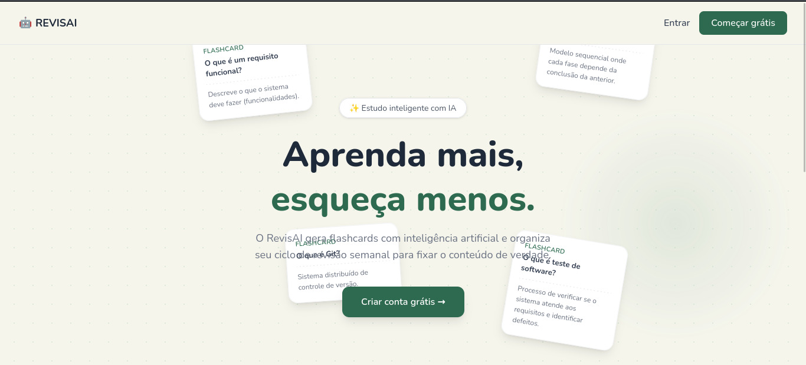
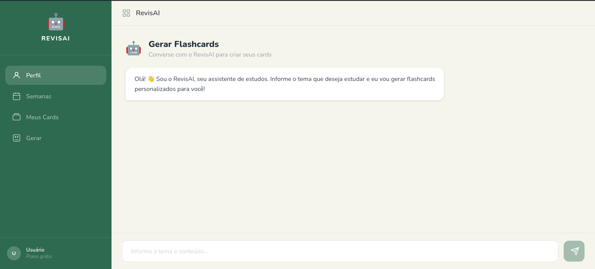

# RevisAI

O RevisAI gera flashcards com inteligência artificial e organiza seu ciclo de revisão semanal para fixar o conteúdo de verdade.

# Rodando localmente

## Clonar o repositório

```
git clone https://github.com/Kayquemts/RevisAI.git
```

## Entrar na pasta
```
cd RevisAI
```

## Instalar dependências
```
npm install
```

## Rodar o projeto
```
npm run dev
```

<p float="left">
  
  </br>
  
</p>